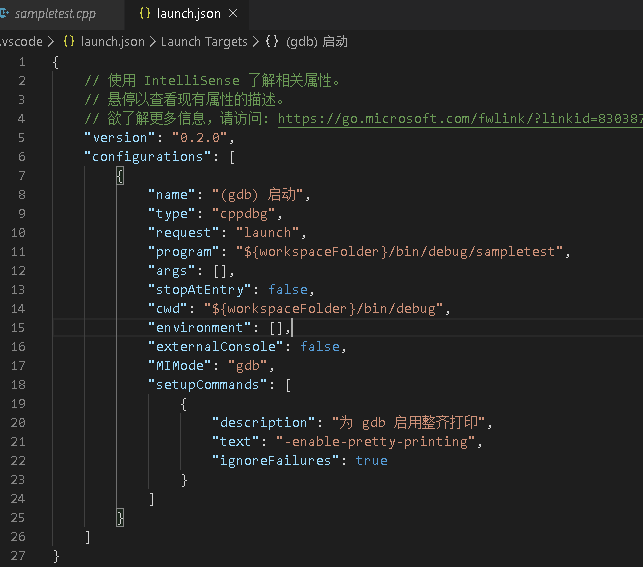

vscode-ssh
-----------------
Copyright (c) 2013-2018 brinkqiang (brink.qiang@gmail.com)

-----------------
vscode ssh 远程调试开发环境搭建
-----------------

<!-- TOC -->

- [安装VSCode版本](#%E5%AE%89%E8%A3%85vscode%E7%89%88%E6%9C%AC)
- [在linux端 解压.vscode-server.zip到账号根目录](#%E5%9C%A8linux%E7%AB%AF-%E8%A7%A3%E5%8E%8Bvscode-serverzip%E5%88%B0%E8%B4%A6%E5%8F%B7%E6%A0%B9%E7%9B%AE%E5%BD%95)
- [安装remote相关插件](#%E5%AE%89%E8%A3%85remote%E7%9B%B8%E5%85%B3%E6%8F%92%E4%BB%B6)
- [打开远程资源管理器](#%E6%89%93%E5%BC%80%E8%BF%9C%E7%A8%8B%E8%B5%84%E6%BA%90%E7%AE%A1%E7%90%86%E5%99%A8)
    - [选择ssh targets 点+号创建一个新的链接](#%E9%80%89%E6%8B%A9ssh-targets-%E7%82%B9%E5%8F%B7%E5%88%9B%E5%BB%BA%E4%B8%80%E4%B8%AA%E6%96%B0%E7%9A%84%E9%93%BE%E6%8E%A5)
    - [输入 ssh 账号@IP地址 -A](#%E8%BE%93%E5%85%A5-ssh-%E8%B4%A6%E5%8F%B7ip%E5%9C%B0%E5%9D%80--a)
    - [右键IP地址](#%E5%8F%B3%E9%94%AEip%E5%9C%B0%E5%9D%80)
    - [输入密码](#%E8%BE%93%E5%85%A5%E5%AF%86%E7%A0%81)
    - [打开工作区](#%E6%89%93%E5%BC%80%E5%B7%A5%E4%BD%9C%E5%8C%BA)
    - [安装cpptools-linux.vsix插件](#%E5%AE%89%E8%A3%85cpptools-linuxvsix%E6%8F%92%E4%BB%B6)
    - [编译调试](#%E7%BC%96%E8%AF%91%E8%B0%83%E8%AF%95)
        - [注意: 例子工程使用了cmake3.2+](#%E6%B3%A8%E6%84%8F-%E4%BE%8B%E5%AD%90%E5%B7%A5%E7%A8%8B%E4%BD%BF%E7%94%A8%E4%BA%86cmake32)
        - [先编译项目](#%E5%85%88%E7%BC%96%E8%AF%91%E9%A1%B9%E7%9B%AE)
        - [F9设置断点](#f9%E8%AE%BE%E7%BD%AE%E6%96%AD%E7%82%B9)
        - [F5调试, 选择C++ GDB/LLDB, 后面默认即可选gcc/g++后续会报错 别选错了](#f5%E8%B0%83%E8%AF%95-%E9%80%89%E6%8B%A9c-gdblldb-%E5%90%8E%E9%9D%A2%E9%BB%98%E8%AE%A4%E5%8D%B3%E5%8F%AF%E9%80%89gccg%E5%90%8E%E7%BB%AD%E4%BC%9A%E6%8A%A5%E9%94%99-%E5%88%AB%E9%80%89%E9%94%99%E4%BA%86)
        - [得到默认启动json配置文件](#%E5%BE%97%E5%88%B0%E9%BB%98%E8%AE%A4%E5%90%AF%E5%8A%A8json%E9%85%8D%E7%BD%AE%E6%96%87%E4%BB%B6)
        - [设置为合理的值, 下图为sample例子调试设置](#%E8%AE%BE%E7%BD%AE%E4%B8%BA%E5%90%88%E7%90%86%E7%9A%84%E5%80%BC-%E4%B8%8B%E5%9B%BE%E4%B8%BAsample%E4%BE%8B%E5%AD%90%E8%B0%83%E8%AF%95%E8%AE%BE%E7%BD%AE)
        - [F5开始调试](#f5%E5%BC%80%E5%A7%8B%E8%B0%83%E8%AF%95)
    - [END](#end)

<!-- /TOC -->

# 1. 安装VSCode版本

安装setup目录VSCodeUserSetup-x64-1.46.1.exe

# 2. 在linux端 解压.vscode-server.zip到账号根目录

用upload_vscode_server脚本上传

命令格式如下upload_vscode_server.bat 账号名(默认值:root) 密码() IP(默认值:127.0.0.1) 端口(默认值:22)

windows
```
upload_vscode_server.bat username passwd 10.246.34.79 22
```

# 3. 安装remote相关插件
打开插件页面 选择从VSIX安装插件 或 Ctrl+Shift+P 输入VSIX安装插件

(setup目录ms-vscode-remote开头的插件全部安装)
其他插件看自己需求
可用install_extension_dev脚本安装

install_extension_dev.(bat || sh)

windows
```
install_extension_dev.bat
```

# 4. 打开远程资源管理器


## 4.1. 选择ssh targets 点+号创建一个新的链接


## 4.2. 输入 ssh 账号@IP地址 -A


例:
```
ssh test@10.246.34.79 -A
```

## 4.3. 右键IP地址


例:
```
右键 10.246.34.79 -> connect to host
```

## 4.4. 输入密码

链接成功会显示绿色图标


## 4.5. 打开工作区
注意: 这个工作区是指远端工作区 非本地

成功的情况 会显示 [SSH: 10.246.34.79]

这里我们打开sample工程 便于测试调试功能

## 4.6. 安装cpptools-linux.vsix插件

## 4.7. 编译调试

### 4.7.1. 注意: 例子工程使用了cmake3.2+
安装之后需要ln一下.
```
sudo rm -rf /usr/bin/cmake
sudo ln /usr/bin/cmake3 /usr/bin/cmake
```

### 4.7.2. 先编译项目


### 4.7.3. F9设置断点


### 4.7.4. F5调试, 选择C++ (GDB/LLDB), 后面默认即可(选gcc/g++后续会报错 别选错了)


### 4.7.5. 得到默认启动json配置文件


### 4.7.6. 设置为合理的值, 下图为sample例子调试设置


### 4.7.7. F5开始调试


## 4.8. END
注意事项: 在外网使用如果本身没有FQ, 请关闭更新, 原因是.vscode-server.zip的版本与客户端的版本必须保持完全一致.


